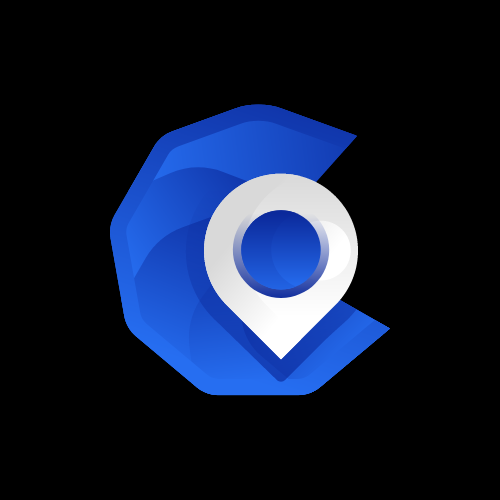
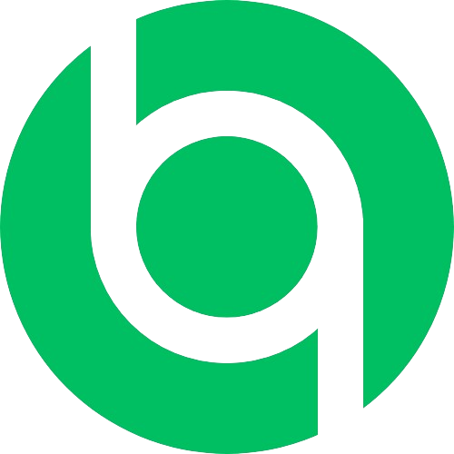

    
    <h2>Fresensi</h2>
    

        v1.0.0
        Android
        Free
    

    
Fresensi App integrated with geolocation (GPS) that can help your company or you as a developer to build a presence app. beauty user interface and have a multi user ( admin and employee ). You can also change the appearance of this application easily or add new features. Using Getx and Firebase.

    
<b>Tech:</b> Flutter, GetX, Firebase.

    
<a href="/apps/fresensi">Read More </a>

    
<i>Released on May 5, 2023</i>

Mobile Application

    <ul style="list-style:none;margin-left:0;margin-top:0;margin-bottom:2;">
        <li>
            
            <a href="https://github.com/agussmkertjhaan/TA-Android/" style="list-style:none;margin-left:0;margin-top:0;margin-bottom:2;" target="_blank">
                BinIQ</a> is built with 
              Kotlin, Android, Compose, Firebase
        </li>
    </ul>

Web Application

    <ul style="list-style:none;margin-left:0;margin-top:0;margin-bottom:2;">
        <li>
            <a href="https://agussmkertjhaan.github.io/projects/" style="list-style:none;margin-left:0;margin-top:0;margin-bottom:2;" target="_blank">
                Poy Wallet Web Services</a> is built with
             Kotlin, Spring, Postgres
        </li>
    </ul> 
    <ul style="list-style:none;margin-left:0;margin-top:0;margin-bottom:2;">
        <li>
            <a href="https://agussmkertjhaan.github.io/projects/" style="list-style:none;margin-left:0;margin-top:0;margin-bottom:2;" target="_blank">
                Vaccine Partner</a> is built with
             Go, Gin, MySQL, JavaScript, Reactjs
        </li>
    </ul>
    <ul style="list-style:none;margin-left:0;margin-top:0;margin-bottom:2;">
        <li>
            <a href="https://agussmkertjhaan.github.io/projects/" style="list-style:none;margin-left:0;margin-top:0;margin-bottom:2;" target="_blank">
                Pertiwi AMS</a> is built with
             PHP, Laravel, MySQL
        </li>
    </ul>
    <ul style="list-style:none;margin-left:0;margin-top:0;margin-bottom:2;">
        <li>
            <a href="https://agussmkertjhaan.github.io/projects/" style="list-style:none;margin-left:0;margin-top:0;margin-bottom:2;" target="_blank">
                CBT</a> is built with
             PHP, Laravel, MySQL
        </li>
    </ul>
    <ul style="list-style:none;margin-left:0;margin-top:0;margin-bottom:2;">
        <li>
            <a href="https://agussmkertjhaan.github.io/projects/" style="list-style:none;margin-left:0;margin-top:0;margin-bottom:2;" target="_blank">
                Permata HMS</a> is built with
             PHP, Laravel, MySQL
        </li>
    </ul>
    <ul style="list-style:none;margin-left:0;margin-top:0;margin-bottom:2;">
        <li>
            <a href="https://agussmkertjhaan.github.io/projects/" style="list-style:none;margin-left:0;margin-top:0;margin-bottom:2;" target="_blank">
                Crowdfunding</a> is built with
             Go, Gin, Postgres
        </li>
    </ul>
    <ul style="list-style:none;margin-left:0;margin-top:0;margin-bottom:2;">
        <li>
            <a href="https://agussmkertjhaan.github.io/projects/" style="list-style:none;margin-left:0;margin-top:0;margin-bottom:2;" target="_blank">
                MZS CBT</a> is built with
             PHP, Laravel, MySQL
        </li>
    </ul>
    <ul style="list-style:none;margin-left:0;margin-top:0;margin-bottom:2;">
        <li>
            <a href="https://agussmkertjhaan.github.io/projects/" style="list-style:none;margin-left:0;margin-top:0;margin-bottom:2;" target="_blank">
                Fos Motor</a> is built with
             PHP, Laravel, MySQL
        </li>
    </ul>

Others

    <ul style="list-style:none;margin-left:0;margin-top:0;margin-bottom:2;">
        <li>
            <a href="https://github.com/agussmkertjhaan/TA-Arduino/" style="list-style:none;margin-left:0;margin-top:0;margin-bottom:2;" target="_blank">
                BinIQ IoT</a> is built with 
             C++, Arduino, Firebase
        </li>
    </ul>
    <ul style="list-style:none;margin-left:0;margin-top:0;margin-bottom:2;">
        <li>
            <a href="https://github.com/agussmkertjhaan/TA-ML/" style="list-style:none;margin-left:0;margin-top:0;margin-bottom:2;" target="_blank">
                Waste Classification</a> is built with 
             Python, TensorFlow, CNN
        </li>
    </ul>

