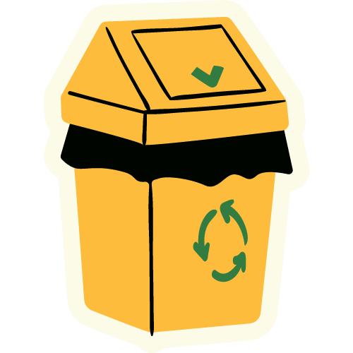
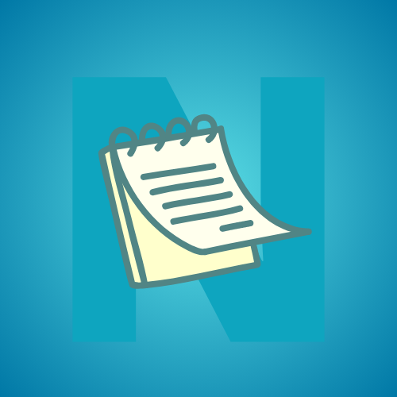
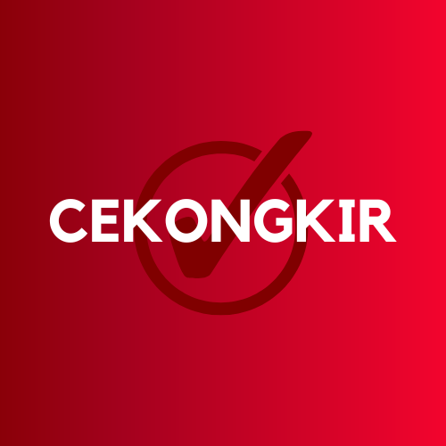

    
    <h2>Model Klasifikasi Sampah</h2>
    

        v1.0.0
        Machine Learning
        Free
    

    
....

    
<b>Tech:</b> Machine Learning, TensorFlow.

    
<a href="/apps/KlasifikasiSampah">Read More </a>

    
<i>Released on May 5, 2023</i>

    
    <h2>Fresensi</h2>
    

        v1.0.0
        Android
        Free
    

    
Fresensi App integrated with geolocation (GPS) that can help your company or you as a developer to build a presence app. beauty user interface and have a multi user ( admin and employee ). You can also change the appearance of this application easily or add new features. Using Getx and Firebase.

    
<b>Tech:</b> Flutter, GetX, Firebase.

    
<a href="/apps/fresensi">Read More </a>

    
<i>Released on May 5, 2023</i>

    
    <h2>FQR Code</h2>
    

        v1.0.0
        Android
        Free
    

    
FQR Code is the management product application integrate with Scanner QR & Barcode.

    
<b>Tech:</b> Flutter, GetX, Firebase.

    
<a href="/apps/fqrcode">Read More </a>

    
<i>Released on May 1, 2023</i>

    
    <h2>Notes</h2>
    

        v1.0
        Android
        Free
    

    
Quickly capture what’s on your mind and get a reminder later at the right place or time.

    
<b>Tech:</b> Android, Kotlin, Room.

    
<a href="/apps/notes">Read More </a>

    
<i>Released on March 30, 2023</i>

    
    <h2>Cekongkir</h2>
    

        v1.0.1
        Android
        iOS
        Free
    

    
Mobile application for cheking the cost of shipping goods in Indonesia.

    
<b>Tech:</b> Flutter, GetX, Firebase.

    
<a href="/apps/cekongkir">Read More </a>

    
<i>Released on March 29, 2023</i>

Application I have built

    <ul style="list-style:none;margin-left:0;margin-top:0;margin-bottom:0;">
        <li>
            
            <a href="https://github.com/agussmkertjhaan/backing-platform-backend/" style="list-style:none;margin-left:0;margin-top:0;margin-bottom:0;" target="_blank">
                Backing Platform API <i>on Feb 15, 2023</i> | 
                Go, Gin-Gonic, MySQL
            </a>
        </li>
        <li>
            
            <a href="http://toeflclass-mzssoftwarehouse.com/" style="list-style:none;margin-left:0;margin-top:0;margin-bottom:0;" target="_blank">
                MZS CBT Website <i>on Nov 5, 2020</i> | 
                PHP, CSS, CodeIgneter, Bootstrap
            </a>
        </li>
        <li>
            
            <a href="https://github.com/agussmkertjhaan/reddot/" style="list-style:none;margin-left:0;margin-top:0;margin-bottom:0;" target="_blank">
                Reddot API <i>on Jul 1, 2020</i> | 
                Kotlin, Spring Boot, Postgres
            </a>
        </li>
        <li>
            
            <a href="https://fosmotor.com/" style="list-style:none;margin-left:0;margin-top:0;margin-bottom:0;" target="_blank">
                FOSMotor Website <i>on Jan 30, 2020</i> | 
                PHP, CSS, Laravel, Bootstrap
            </a>
        </li>
    </ul>

